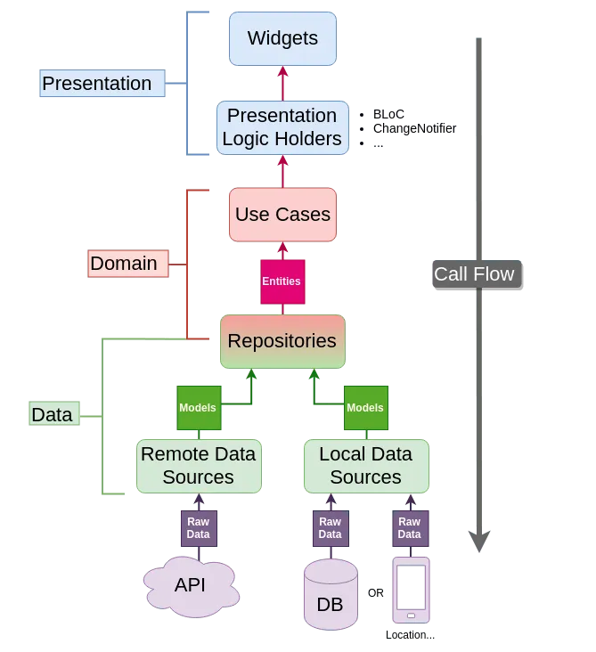
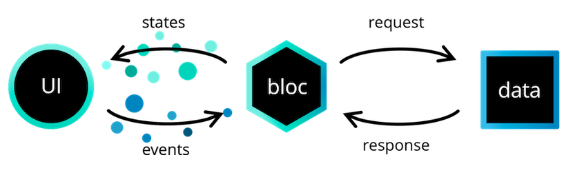

# Flutter Auth Bloc

This project aim to use Bloc for authenticate Users in a application using Otp (Phone Verification), also known as passwordless mode.

There will be two versions: one using Firebase and other using Http/OAuth.

It also an opportunity to use Clean Architecture, DDD, TDD and deploy in a CI/CD tool.

## Flutter Clean Architecture

The overriding rule that makes this architecture work is *The Dependency Rule*. This rule says that source code dependencies can only point inwards. Nothing in an inner circle can know anything at all about something in an outer circle. In particular, the name of something declared in an outer circle must not be mentioned by the code in the an inner circle. That includes, functions, classes. variables, or any other named software entity.

By the same token, data formats used in an outer circle should not be used by an inner circle, especially if those formats are generate by a framework in an outer circle. We don’t want anything in an outer circle to impact the inner circles.

### Contents of Domain
`Domain` is made up of several things.

#### Entities
- Enterprise-wide business rules
- Made up of classes that can contain methods
- Business objects of the application
Used application-wide
- Least likely to change when something in the application changes
#### Usecases
- Application-specific business rules
- Encapsulate all the usecases of the application
- Orchestrate the flow of data throughout the app
- Should not be affected by any UI changes whatsoever
- Might change if the functionality and flow of application change
- This should differ when using BloC, more clarifications later on.
#### Repositories
- Abstract classes that define the expected functionality of outer layers
- Are not aware of outer layers, simply define expected functionality
    - E.g. The Login usecase expects a Repository that has login functionality
- Passed to Usecases from outer layers
`Domain` represents the inner-most layer. Therefore, it the most abstract layer in the architecture.

### Presentation

`Presentation` is the layer outside `Domain`. `Presentation` crosses the boundaries of the layers to communicate with `Domain`. However, *the Dependency Rule* is never violated. Using polymorphism, `Presentation` communicates with `Domain` using inherited class: classes that implement or extend the Repositories present in the `Domain` layer. Since polymorphism is used, the Repositories passed to `Domain` still adhere to the *Dependency Rule* since as far as `Domain` is concerned, they are abstract. The implementation is hidden behind the polymorphism.

### Contents of Presentation
 `Presentation` layer contains the UI in the form of Widgets and also the presentation logic holders, which can be implemented as a ChangeNotifier, `Bloc`, Reducer, ViewModel, MobX Store... This tutorial will implement the BLoC pattern using the flutter_bloc package.

##  Reso Coder's Clean Architecture Proposal

This is a architecture design proposed by ResoCoder using Clean principles:

# BLoC

**BLoC**, also written as BLoC is an abbreviation for **Business Logic Component**. Following the *Reso Coder's Clean Architecture Proposal*, he claims it should rather be called a PLoC (Presentation Logic Component), because all the **business logic** is in the **domain layer**, after all.

Nevertheless, BLoC (as proposed by *Felix Angelov*) also claims that it allow us to separate our application into three layers:
* Presentation
* Business Logic
* Data
    * Repository
    * Data Provider

#### BLoC Architecture

The **presentation layer's** responsibility is to figure out how to render itself based on one or more bloc states. In addition, it should handle user input and application lifecycle events.

The **business logic (bloc)** layer's responsibility is to respond to events from the presentation layer with new states. The bloc layer can depend on one or more repositories to retrieve data needed to build up the application state.
​Every bloc has a state stream which other blocs can subscribe to in order to react to changes within the bloc.

Finally, the **data layer's** responsibility is to retrieve/manipulate data from one or more sources: The **repository layer** is a wrapper around one or more data providers with which the Bloc Layer communicates. The **data provider's** responsibility is to provide raw data. The data provider should be generic and versatile.